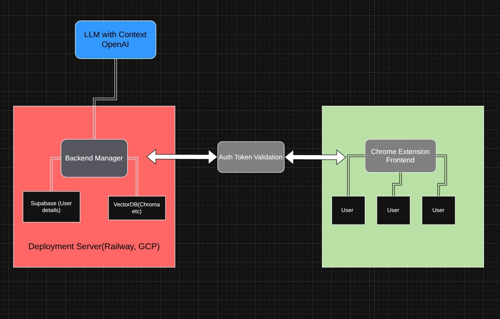

# Askify: Smart AI-Powered Web Assistant Chrome Extension

Askify is an intelligent Chrome extension that allows users to ask questions about any webpage they're visiting. Using advanced AI and Retrieval Augmented Generation (RAG), it provides accurate, context-aware answers based on the webpage content.



## 🚀 Features

- **Smart Query Answering**: Ask questions about any webpage and get accurate answers based on the content
- **AI-Powered Analysis**: Uses OpenAI models with LangChain for intelligent content processing
- **User Authentication**: Secure login/signup system with encrypted password storage
- **Query History**: Saves your questions and answers for future reference
- **Modern UI**: Clean, modern interface with dark/light theme support
- **Privacy-Focused**: Minimal permissions - only sends URLs to backend, content extraction happens server-side
- **Offline Access**: Save important answers for offline viewing
- **Customizable Settings**: Adjust theme, font size, and display preferences
- **Copy to Clipboard**: Easily copy answers for use elsewhere
- **Character Counter**: Visual feedback for query length limits

## 🏗️ Architecture

Askify follows a secure client-server architecture:

1. **Chrome Extension Frontend**: Modern React-like UI for user interaction
2. **Python FastAPI Backend**: Handles content extraction, AI processing, and data management
3. **Vector Database**: ChromaDB for efficient semantic search and RAG
4. **User Database**: Supabase for user management and history storage
5. **AI Integration**: OpenAI models via LangChain for content analysis


## 📋 Prerequisites

Before setting up Askify, ensure you have:

- **Python 3.8+** installed on your system
- **Google Chrome** browser
- **OpenAI API key** ([Get one here](https://platform.openai.com/api-keys))
- **Supabase account** (optional, for user management - [Sign up here](https://supabase.com/))

## 🛠️ Backend Setup

### 1. Clone and Navigate
```bash
git clone <repository-url>
cd Askify/backend
```

### 2. Environment Configuration
```bash
# Copy the environment template
cp .env.sample .env
```

Edit the `.env` file with your credentials:
```env
# Required: OpenAI API Key
OPENAI_API_KEY=your-openai-api-key-here

# Required: Secret key for JWT tokens
SECRET_KEY=your-secret-key-here

# Optional: Supabase credentials (for user management)
SUPABASE_URL=your-supabase-project-url
SUPABASE_KEY=your-supabase-anon-key

# Optional: CORS settings (add your extension ID after installation)
ALLOWED_ORIGINS=chrome-extension://YOUR_EXTENSION_ID,http://localhost:3000
```

**Generate a secure secret key:**
```bash
python scripts/generate_keys.py --type=hex
```

### 3. Install Dependencies
```bash
pip install -r requirements.txt
```

### 4. Database Setup (Optional - Supabase)
If you want user authentication and history storage:

1. Create a new project on [Supabase](https://supabase.com/)
2. Go to the SQL Editor in your Supabase dashboard
3. Run the SQL script from `scripts/supabase_setup.sql`
4. Add your Supabase URL and key to the `.env` file

### 5. Start the Backend Server
```bash
python run.py
```

The server will start on `http://localhost:8000`. You should see:
```
INFO:     Started server process
INFO:     Uvicorn running on http://0.0.0.0:8000
```

## 🔧 Chrome Extension Setup

### 1. Configure the Extension
Edit `extension/config.js` to point to your backend:
```javascript
const CONFIG = {
    API_BASE_URL: 'http://localhost:8000/api/v1',
    // ... other settings
};
```

### 2. Install the Extension
1. Open Chrome and go to `chrome://extensions/`
2. Enable **Developer mode** (toggle in top-right)
3. Click **Load unpacked**
4. Select the `extension` folder from this project
5. The Askify extension should now appear in your Chrome toolbar

### 3. Update CORS Settings
1. After loading the extension, copy the **Extension ID** from the Chrome extensions page
2. Update your backend `.env` file:
   ```env
   ALLOWED_ORIGINS=chrome-extension://YOUR_EXTENSION_ID_HERE,http://localhost:3000
   ```
3. Restart the backend server:
   ```bash
   python run.py
   ```

## 🎯 Usage

### Getting Started
1. **Navigate** to any webpage in Chrome
2. **Click** the Askify extension icon in your toolbar
3. **Sign up** or **log in** with your email and password
4. **Ask questions** about the webpage content
5. **View your history** of previous questions and answers

### Example Queries
- "What is the main topic of this article?"
- "Summarize the key points in bullet format"
- "What are the pricing details mentioned?"
- "Who is the author of this content?"
- "What are the contact details provided?"

## 🛠️ Development

### Backend Structure
```
backend/
├── app/
│   ├── api/endpoints/     # API route handlers
│   ├── auth/             # Authentication utilities
│   ├── core/             # Configuration and settings
│   ├── db/               # Database connections and operations
│   ├── models/           # Data models and schemas
│   └── services/         # Business logic and AI integration
├── scripts/              # Utility scripts and database setup
└── requirements.txt      # Python dependencies
```

### Extension Structure
```
extension/
├── background/           # Background service worker
├── content/             # Content scripts (currently minimal)
├── images/              # Extension icons and logos
├── popup/               # Main UI components
├── styles/              # CSS styling
├── config.js            # Configuration settings
└── manifest.json        # Extension manifest
```

### Running in Development Mode
1. **Backend**: The FastAPI server supports hot reload - just save your changes
2. **Extension**: After making changes, go to `chrome://extensions/` and click the refresh icon on your extension

## 🎨 Customization

### Themes
- Built-in light and dark themes
- Customize colors in `extension/styles/popup.css`

### Settings
Users can customize:
- Theme preference (light/dark)
- Font size for better readability
- Maximum number of history items to display
- Offline mode for saving answers locally

## 🔒 Privacy & Security

- **Minimal Permissions**: Extension only sends webpage URLs to the backend
- **Server-Side Processing**: All content extraction happens on your backend
- **Encrypted Storage**: User passwords are securely hashed
- **Local Data**: ChromaDB data is stored locally on your server
- **No Third-Party Tracking**: No analytics or tracking beyond essential functionality

## 🤝 Contributing

1. Fork the repository
2. Create a feature branch: `git checkout -b feature-name`
3. Make your changes and test thoroughly
4. Submit a pull request with a clear description

## 📄 License

This project is licensed under the MIT License - see the [LICENSE](LICENSE) file for details.

## 🙏 Acknowledgments

- [OpenAI](https://openai.com/) for providing the AI models
- [LangChain](https://langchain.com/) for the RAG framework
- [FastAPI](https://fastapi.tiangolo.com/) for the backend framework
- [Supabase](https://supabase.com/) for database and authentication
- [ChromaDB](https://www.trychroma.com/) for vector storage
