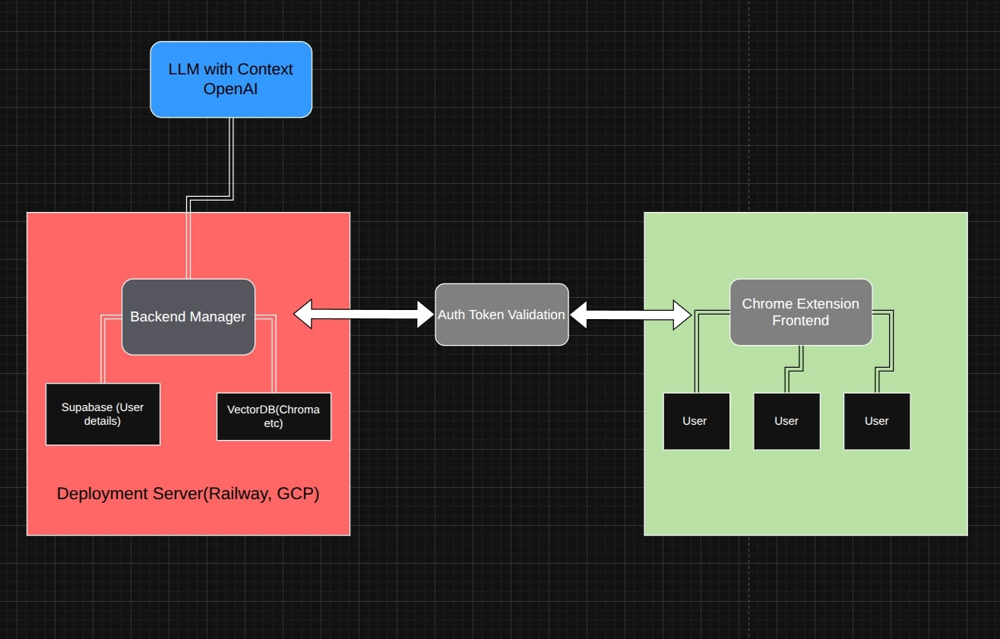

# Paperwise: Smart Query Answering Chrome Extension

Paperwise is a Chrome extension that enables users to ask questions about web pages they visit. It leverages LangChain and Retrieval Augmented Generation (RAG) to provide accurate, context-aware answers based on the webpage content.

## Architecture

Paperwise follows a client-server architecture:

1. **Chrome Extension Frontend**: User interface for interacting with the system
   - Provides a UI for users to ask questions about the current webpage
   - Sends URLs and queries to the backend
   - Displays results to users
2. **Python FastAPI Backend**: Handles requests, processes data, and communicates with LLMs
   - Uses BeautifulSoup via LangChain to extract webpage content
   - Processes and stores content in vector database
   - Performs RAG (Retrieval Augmented Generation) for answering queries
3. **Database Layer**: 
   - Supabase for user management and history storage
   - ChromaDB for vector embeddings and RAG functionality
4. **AI Integration**: Uses OpenAI models through LangChain for content processing and RAG



## Features

- **Server-Side Content Extraction**: Uses BeautifulSoup on the backend to extract webpage content
- **Query Answering**: Answer questions about the current webpage using RAG
- **User Authentication**: Secure login/signup system using Supabase
- **History Tracking**: Saves user browsing and query history for future reference
- **Cross-Page Context**: Leverages previously visited pages to enhance answers
- **Minimal Extension Permissions**: Extension only needs to send URLs, not extract content

## Setup and Installation

### Backend Setup

1. **Prerequisites**:
   - Python 3.8+ installed
   - Supabase account 
   - OpenAI API key

2. **Installation**:
   ```bash
   cd backend
   python setup.py
   ```

3. **Configuration**:
   Edit the `.env` file with your credentials:
   ```
   OPENAI_API_KEY=your-openai-api-key
   SUPABASE_URL=your-supabase-url
   SUPABASE_KEY=your-supabase-anon-key
   ```

4. **Database Setup**:
   Run the SQL script in `scripts/supabase_setup.sql` in your Supabase SQL editor

5. **Start the server**:
   ```bash
   python run.py
   ```

### Chrome Extension Setup

1. **Install Extension in Developer Mode**:
   - Open Chrome and navigate to `chrome://extensions/`
   - Enable "Developer mode"
   - Click "Load unpacked" and select the `extension` folder

2. **Configure API URL**:
   - The extension is configured to use `http://localhost:8000/api/v1` by default
   - For production, update `API_BASE_URL` in:
     - `extension/background/background.js`
     - `extension/popup/popup.js`

## Usage

1. **Authentication**:
   - Click the extension icon
   - Sign up or log in using your email and password

2. **Ask Questions**:
   - Navigate to any webpage
   - Click the extension icon
   - Type your question in the text area
   - Click "Get Answer"

3. **View History**:
   - Previous questions are saved and displayed in the history section
   - Click on a previous question to ask it again

## Development

### Backend Development

The backend is built with FastAPI and follows a modular structure:
- `app/main.py`: Main application entry point
- `app/api/`: API routes and endpoint handlers
- `app/services/`: Business logic and external service integrations
- `app/db/`: Database connections and operations
- `app/models/`: Data models and schemas

### Chrome Extension Development

The extension follows Chrome's recommended structure:
- `manifest.json`: Extension configuration
- `background/`: Background service worker for handling browser events
- `content/`: Content scripts for extracting webpage content
- `popup/`: User interface for the extension popup
- `styles/`: CSS styles for the popup

## Deployment

See [DEPLOYMENT.md](DEPLOYMENT.md) for detailed instructions on:
- Containerizing the application with Docker
- Deploying to Railway
- Deploying to Google Cloud Platform
- Configuration for production environments

## License

[MIT License](LICENSE)

## Acknowledgments

- [LangChain](https://langchain.com/) for RAG implementation
- [FastAPI](https://fastapi.tiangolo.com/) for the API framework
- [Supabase](https://supabase.io/) for authentication and database
- [OpenAI](https://openai.com/) for LLM capabilities
