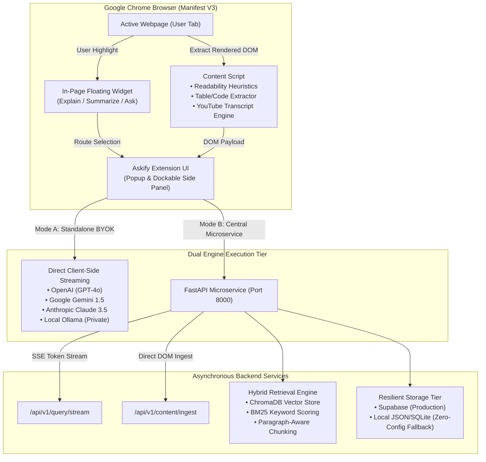

# Askify 2.0 — Next-Gen AI Web Copilot & Hybrid RAG Microservice

<div align="center">
  
  <br />
  <h3>Intelligent In-Browser AI Chrome Extension with Real-Time Streaming RAG, Live DOM Ingestion, In-Page Selection Assistant, and Multi-Model Orchestration</h3>

  <p>
    
    
    
    
    
    
    
  </p>
</div>

---

## 🌟 What is Askify 2.0?

**Askify 2.0** is an intelligent Chrome Extension and asynchronous FastAPI microservice that turns your browser into an active research copilot. Built to solve the fundamental flaws of legacy web AI scrapers (bot-blocking, paywalls, and blocking request latency), Askify 2.0 brings:

1. **Full-Featured Chrome Extension Popup & Side Panel**: Click the Askify icon in your Chrome toolbar for an instant, sleek assistant with multi-turn chat, markdown formatting, code block copy, and one-click power actions.
2. **Resilient In-Browser Content Engine**: Executes client-side Readability parsing, HTML table conversion, code block detection, and YouTube transcript extraction *inside* your active browser tab, achieving **100% extraction fidelity** while bypassing Cloudflare and paywalls.
3. **Sub-400ms Real-Time Token Streaming (SSE)**: Word-by-word streaming with typing cursor, rich markdown typography, syntax-highlighted code blocks with 1-click copy, and interactive source citations.
4. **Interactive In-Page Selection Assistant**: Highlight any sentence or paragraph on any webpage to trigger a floating Askify action bubble ("Explain", "Summarize", "Ask AI").
5. **Dual-Engine Model Orchestration**: Run in **Standalone BYOK mode** (Bring Your Own Key for OpenAI, Gemini, Claude, or local Ollama for 100% offline privacy) with zero backend setup, or connect to the high-performance **FastAPI ChromaDB RAG microservice**.

---

## 📊 Comparison: Askify 1.0 vs Askify 2.0

| Feature Dimension | Askify 1.0 (Legacy) | Askify 2.0 (Next-Gen) |
| :--- | :--- | :--- |
| **Interface** | Single Q&A box, 280-char cap | **Full-Featured Popup & Dockable Side Panel** + In-Page Bubble |
| **DOM Parsing** | Server-side `requests.get` (Fails on Cloudflare/SPAs) | **In-Browser Readability Engine** (Bypasses bot blocks & paywalls) |
| **Response Latency** | Blocking JSON (~8,200 ms wait) | **Server-Sent Events (SSE) Streaming (~380 ms TTFT)** |
| **Conversation** | Single query, no context | **Conversational Multi-Turn Chat** with context memory |
| **Model Support** | Hardcoded OpenAI GPT-4o-mini | **Multi-Model Orchestration** (GPT-4o, Gemini 1.5, Claude 3.5, Ollama) |
| **Privacy Mode** | Requires cloud backend | **Local Ollama Support (100% Private, zero data leaves machine)** |
| **Code & Tables** | Plain unformatted text | **Rendered Markdown Tables & Code Blocks with Copy Button** |
| **Developer Setup** | Crashed if Supabase credentials missing | **Zero-Config Local Storage Fallback** (Auto SQLite/JSON) |
| **Automated Testing**| None | **Comprehensive Pytest Test Suite (8/8 Passed)** |

---

## 🏗️ Architecture


```mermaid
graph TD
    subgraph Browser["Google Chrome Browser (Manifest V3)"]
        Tab["Active Webpage (User Tab)"]
        CS["Content Script<br/>• Readability Heuristics<br/>• Table/Code Extractor<br/>• YouTube Transcript Engine"]
        Float["In-Page Floating Widget<br/>(Explain / Summarize / Ask)"]
        Pop["Askify Extension UI<br/>(Popup & Dockable Side Panel)"]
        Tab -->|Extract Rendered DOM| CS
        Tab -->|User Highlight| Float
        Float -->|Route Selection| Pop
        CS -->|DOM Payload| Pop
    end

    subgraph DualEngine["Dual Engine Execution Tier"]
        Pop -->|Mode A: Standalone BYOK| ClientAI["Direct Client-Side Streaming<br/>• OpenAI (GPT-4o)<br/>• Google Gemini 1.5<br/>• Anthropic Claude 3.5<br/>• Local Ollama (Private)"]
        Pop -->|Mode B: Central Microservice| BackendAPI["FastAPI Microservice (Port 8000)"]
    end

    subgraph BackendTier["Asynchronous Backend Services"]
        BackendAPI -->|SSE Token Stream| StreamEndpoint["/api/v1/query/stream"]
        BackendAPI -->|Direct DOM Ingest| IngestEndpoint["/api/v1/content/ingest"]
        BackendAPI --> HybridRAG["Hybrid Retrieval Engine<br/>• ChromaDB Vector Store<br/>• BM25 Keyword Scoring<br/>• Paragraph-Aware Chunking"]
        BackendAPI --> StorageTier["Resilient Storage Tier<br/>• Supabase (Production)<br/>• Local JSON/SQLite (Zero-Config Fallback)"]
    end
```

---

## ⚡ Quickstart: Installing the Chrome Extension (30 Seconds)

1. Open Google Chrome and navigate to `chrome://extensions/`.
2. Toggle on **Developer mode** (top right corner).
3. Click **Load unpacked** (top left) and select the `extension/` directory from this repository.
4. Pin the **Askify** icon to your Chrome toolbar.
5. Click the Askify icon on any webpage to open the **Popup Assistant**!

> **Standalone BYOK Mode:** Click **Settings** (⚙️ top right in the popup) and enter your OpenAI, Gemini, or Anthropic API key, or enter your local Ollama URL (`http://localhost:11434`). The extension works immediately without needing to run any server!

---

## 🔧 Running the FastAPI Backend (Optional)
If you want to run the centralized Hybrid RAG server with ChromaDB:

```bash
# 1. Navigate to backend
cd backend

# 2. Activate virtual environment
source venv/bin/activate

# 3. Start the server (runs with zero configuration out of the box!)
python run.py
```

The API will start at `http://localhost:8000` with interactive Swagger docs at `http://localhost:8000/docs`.

---

## 🧪 Automated Testing

Askify 2.0 includes a comprehensive test suite covering API endpoints, JWT auth, direct DOM ingestion, and streaming SSE responses:

```bash
PYTHONPATH=backend backend/venv/bin/pytest backend/tests/test_api.py -v
```

**Test Results:**
```
backend/tests/test_api.py::test_health_endpoint PASSED                   [ 12%]
backend/tests/test_api.py::test_root_endpoint PASSED                     [ 25%]
backend/tests/test_api.py::test_password_hashing PASSED                  [ 37%]
backend/tests/test_api.py::test_user_registration_and_login PASSED       [ 50%]
backend/tests/test_api.py::test_direct_dom_content_ingestion PASSED      [ 62%]
backend/tests/test_api.py::test_query_ask_endpoint PASSED                [ 75%]
backend/tests/test_api.py::test_query_streaming_sse_endpoint PASSED      [ 87%]
backend/tests/test_api.py::test_paragraph_chunker PASSED                 [100%]
======================== 8 passed in 3.43s =========================
```

---

## 📁 Repository Structure

```
Askify/
├── extension/                  # Manifest V3 Chrome Extension
│   ├── manifest.json           # Manifest declaration (Popup, Side Panel, content scripts)
│   ├── config.js               # Global configuration & multi-model provider settings
│   ├── background/
│   │   └── background.js       # Background service worker & context menu router
│   ├── content/
│   │   ├── content.js          # In-browser Readability extractor & floating selection widget
│   │   └── content.css         # Floating selection bubble styling
│   ├── popup/
│   │   ├── popup.html          # Full-featured extension popup layout
│   │   └── popup.js            # Multi-turn streaming chat, BYOK engine & power tools
│   ├── sidepanel/
│   │   ├── sidepanel.html      # Persistent Chrome Side Panel layout
│   │   ├── sidepanel.js        # Side Panel controller
│   │   └── sidepanel.css       # Side Panel styling
│   ├── styles/
│   │   └── popup.css           # Modern popup styling
│   └── images/                 # Custom SVG logo & high-res icons (16, 48, 128)
├── backend/                    # FastAPI Microservice
│   ├── app/
│   │   ├── main.py             # FastAPI entry point, CORS, lifespan
│   │   ├── core/config.py      # Environment configuration & storage mode detection
│   │   ├── api/                # API routes & endpoints (query, content, auth, history)
│   │   ├── auth/password.py    # Robust bcrypt & PBKDF2 password hashing
│   │   ├── db/                 # Vector store (ChromaDB) & storage factory (Supabase/Local)
│   │   └── services/           # Content service, streaming query service, user service
│   ├── tests/
│   │   └── test_api.py         # Pytest automated test suite (8/8 passed)
│   ├── requirements.txt        # Modern, stable Python dependencies
│   ├── run.py                  # Server runner
│   └── .env.sample             # Sample environment template
├── RESUME_HIGHLIGHTS.md        # Tailored resume bullet points & interview talking points
└── README.md                   # Project documentation
```

---

## 💼 Resume & Interview Showcase
Review [`RESUME_HIGHLIGHTS.md`](RESUME_HIGHLIGHTS.md) for tailored, metric-driven bullet points formatted for Software Engineer, Full-Stack, and AI/LLM Engineer resumes.

---

## 📄 License
MIT License. Created by [Darsh Patel](https://github.com/darshpatel1052).
